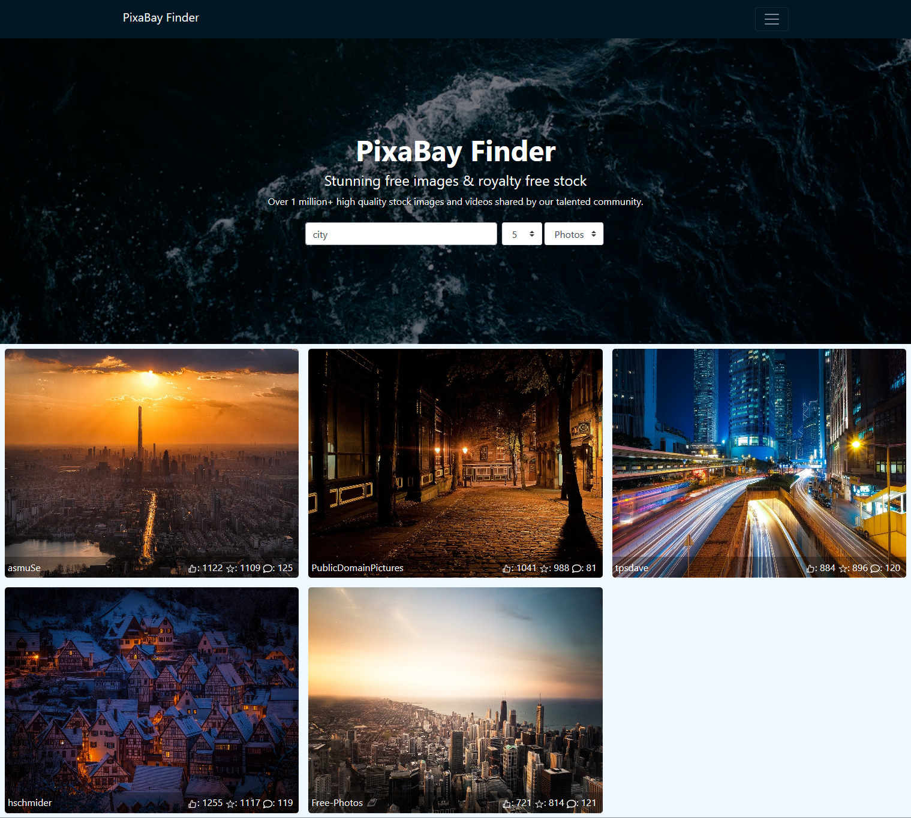

# **PixaBay Finder**

`React & bootstrap UI application to find images and videos utilizing the PixaBay API`

**Find your API Key at https://pixabay.com/api/docs/#api_key  and make sure to put that in home.jsx file**

# **Quick Start**
    # Install dependencies
    npm install

    # Serve on localhost:3000
    npm start

    # Build for production
    npm run build

